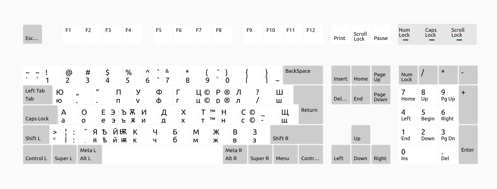
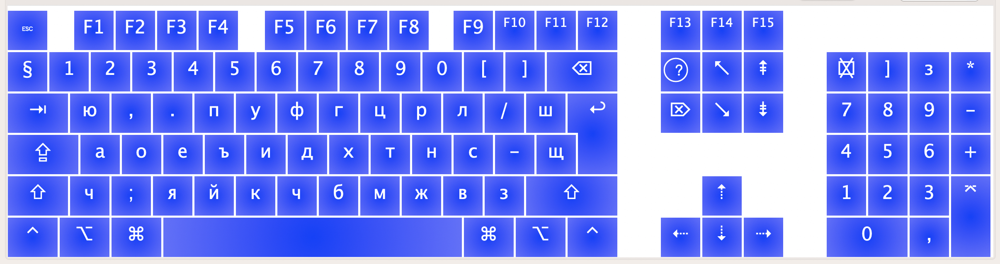

# Bulgarian Dvorak Phonetic Keyboard Layout

Type Bulgarian Cyrillic using phonetic positions based on US Dvorak.
The supplied mappings and native layout identities are preserved by the installer.




## Installation, update, or repair

The same command installs a fresh layout, updates an existing copy, repairs identifiable
project components, or reports that everything is current. Installation does not select
an input source or restart your session.

Target environments:

| OS | Architecture | Scope |
|---|---|---|
| Ubuntu Desktop 24.04, GNOME X11/Wayland | x86_64 | Explicit system scope |
| macOS 15 | Intel / Apple Silicon | Current user |
| macOS 26 | Apple Silicon | Current user |

Native macOS and desktop release validation remain pending; see
[validation status](specs/001-automate-layout-install/validation/final.md).
Windows and other OS versions are not supported by this feature.

### Prepare once

Install **uv 0.12.16** using the [official release instructions](https://github.com/astral-sh/uv/releases/tag/0.12.16).
Python **3.14.7** is required (`>=3.14.7,<3.15`); the explicit setup below obtains it even
when your OS does not include Python. Do not run uv or environment setup with sudo.

```sh
git clone https://github.com/overthetop/bg-dvorak-phonetic.git
cd bg-dvorak-phonetic
uv python install 3.14.7
uv sync --locked --dev
```

On Ubuntu, install native validation prerequisites before running the installer:

```sh
sudo apt-get install xkb-data libxkbcommon-tools
```

macOS uses its native `plutil` tool; Ukelele is not required.

### Run the installer

Ubuntu:

```sh
uv run --no-project --python .venv/bin/python --no-python-downloads --offline bg-dvorak-phonetic install --scope system
```

macOS:

```sh
uv run --no-project --python .venv/bin/python --no-python-downloads --offline bg-dvorak-phonetic install
```

Add `--dry-run` to preview. Review the plan before accepting it. `--yes` accepts the plan
for noninteractive use; it does not bypass sudo authorization or select system scope.
Product commands do not provision or upgrade the Python environment. If preparation is
missing or stale, rerun the explicit setup commands.

After installation, add the layout in your OS keyboard settings. Linux uses layout **bg**
and variant **bg-dvorak-phonetic**. On macOS use System Settings → Keyboard → Text Input → Edit.
Actual discovery, selection, and typing must be checked on your desktop.

Read the [installation and recovery guide](docs/installation.md),
[contributor guide](docs/development.md), and [release checklist](docs/release-validation.md).
