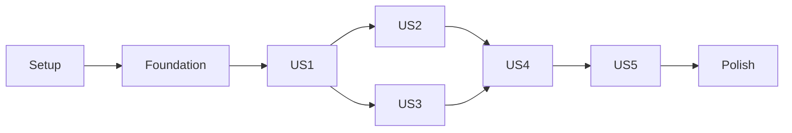

# Tasks: Automated Linux and macOS Layout Installation

**Input**: Design documents from `specs/001-automate-layout-install/`
**Prerequisites**: [plan.md](plan.md), [spec.md](spec.md), [research.md](research.md),
[data-model.md](data-model.md), [CLI contract](contracts/cli.md),
[adapter contract](contracts/platform-adapter.md), [quickstart.md](quickstart.md)
**Governance**: `.specify/memory/constitution.md` v1.1.0.
**Tests**: Explicitly requested; behavioral, contract, native integration and CI tests are mandatory.
**Organization**: Five user stories in specification priority order. Tasks are implementation work,
not claims of completed code or verified OS support.

## Format: `[ID] [P?] [Story] Description`

- Every task has a checkbox, sequential ID, exact target path and a story label where applicable.
- [P] identifies independent work within the ready-to-run waves listed below; prerequisites
  must be complete first. A marker never authorizes simultaneous edits to the same file.
- Story check tasks remain open until their required evidence exists. Missing macOS/CI/manual
  access must be recorded as pending, not treated as a passing result.
- New behavior tests precede implementation; verify a meaningful failure first where the behavior
  is absent. Existing-behavior regression tests may already pass; do not manufacture failures.

## Path Conventions

All paths are repository-relative. Production code is under `src/bg_dvorak_phonetic/`;
tests use `tests/unit/`, `tests/contract/`, `tests/integration/` and `tests/fixtures/`.
Existing `linux/` and `mac-os/` assets retain their identities. Validation records go under
`specs/001-automate-layout-install/validation/` and must state actual environments and outcomes.
Do not modify Spec Kit's internal scripts, create Windows implementation, or change keyboard mappings.

## Phase 1: Setup (Shared Infrastructure)

**Purpose**: Establish the pinned Python project and safe test harness.

- [X] T001 Create Python metadata and console entry point declaration in `pyproject.toml` and pin CPython 3.14.7 in `.python-version`; require `>=3.14.7,<3.15`, uv 0.12.16, a minimal locked build backend, and a development group containing pytest, coverage.py, Ruff, and mypy; keep runtime dependencies standard-library-only.
- [X] T002 Create import-safe package scaffolding in `src/bg_dvorak_phonetic/__init__.py`, `src/bg_dvorak_phonetic/__main__.py`, and `src/bg_dvorak_phonetic/cli.py`; expose console/module entry points to the same main function without performing installation at import time.
- [X] T003 Configure Ruff lint/format, strict mypy, pytest importlib mode and test paths in `pyproject.toml`; ignore environments, bytecode, test reports, and coverage artifacts in `.gitignore` without ignoring `uv.lock`.
- [X] T004 [P] Create fixture builders and filesystem/process injection harness in `tests/conftest.py` and `tests/fixtures/README.md`; isolate all test destinations from live keyboard configuration and preserve the original `linux/` and `mac-os/` assets as authoritative inputs.
- [X] T005 Resolve and commit exact tooling/build versions in `uv.lock`; run locked environment setup and entry-point smoke checks, recording commands and results in `specs/001-automate-layout-install/validation/setup.md`; verify stale-lock rejection and that setup does not modify system Python. Keep environment provisioning an explicit setup step; product invocations disable synchronization, Python downloads and uv network access.

**Checkpoint**: Pinned setup and isolated test scaffolding are ready.

---

## Phase 2: Foundational (Blocking Prerequisites)

**Purpose**: Build shared contracts, state, diagnostics, and recoverable mutation boundaries before product workflows.

**Blocking gate**: Complete setup and all foundational tasks before story implementation.

- [X] T006 Add model validation and serialization tests in `tests/unit/test_models.py` for immutable plans, enum values, generated IDs, UTF-8 journal schema version 1, unsupported-schema refusal, and the exact constraints quoted in T007.
- [X] T007 Implement typed dataclasses/enums in `src/bg_dvorak_phonetic/models.py` with all fields from `data-model.md`: PlatformContext — "Validated support matrix; canonical roots determined by adapter; no user-supplied arbitrary root in production"; LayoutAssets — "Source must be complete and validate; hashes, not bundle version alone, determine updates"; InstallationState — "health: absent/current/outdated/repairable/unsafe; only project identities count as registrations"; ChangePlan — "Immutable after authorization; install/update/repair/noop; unsafe state yields no apply plan"; FileOperation — "Restricted destinations; replace/create/remove-owned-duplicate; no arbitrary commands; symlinks rejected except verified distro registry alias"; RecoveryRecord — "Persist before each mutation; protect permissions; durable step transitions; backup ownership matches scope"; RunResult — "Installation success never implies active keyboard selection"; DiagnosticEvent — "Ordered stderr messages; no credentials; traceback only in debug mode". Persistent journal JSON "uses schema_version=1 and explicit UTF-8; unsupported schemas are refused without mutation."
- [X] T008 Define the typed platform protocol and injected filesystem/command boundaries in `src/bg_dvorak_phonetic/platforms/base.py` and static lazy adapter registry in `src/bg_dvorak_phonetic/platforms/__init__.py`, matching all nine operations and invariants in `contracts/platform-adapter.md`; leave native implementation to story tasks.
- [X] T009 [P] Implement checkout-root resolution, complete asset inventory, SHA-256 manifests and bounded argument-list command execution in `src/bg_dvorak_phonetic/workflow.py`, with tests in `tests/unit/test_assets.py`; resolve independently of cwd, reject missing/malformed sources and unsafe paths, preserve metadata, and enforce 30-second validator timeouts. Implement read-only preflight for the prepared project environment, pinned interpreter and installed runtime dependencies against metadata/uv.lock; fail stale/missing setup with preparation commands and no global fallback or runtime changes.
- [X] T010 [P] Implement baseline ordered stderr events and error categories in `src/bg_dvorak_phonetic/diagnostics.py`, with tests in `tests/unit/test_diagnostics.py`; include UTC timestamp/run ID, stage, severity, operation/path, cause/remedy and debug-only traceback, with no credentials or full environment dumps.
- [X] T011 [P] Add journal, lock, before/after-hash, staging, rollback and permission tests in `tests/unit/test_transaction.py`; cover all state transitions in `data-model.md`, crash boundaries, symlink rejection, external edits, and no-op without backups before implementing mutations.
- [X] T012 Implement protected state roots, exclusive lock integration, snapshot revalidation, backups, durable journal steps and same-filesystem staging in `src/bg_dvorak_phonetic/transaction.py`; enforce Linux `/var/lib/bg-dvorak-phonetic` root ownership and macOS user state ownership, "directory mode 0700", and "Journals and backup metadata use mode 0600." Keep backup bundles outside discoverable keyboard paths.
- [X] T013 Implement reverse-order rollback and journaled bundle rename restoration in `src/bg_dvorak_phonetic/transaction.py`; preserve original bytes/modes/ownership and use generated run IDs: "Store run IDs as generated identifiers, never user-controlled path fragments." Enforce "Retain successful-change backups until documented explicit user cleanup; do not create a new backup for noop" and "Cleanup must never delete unfinished transactions." Do not claim multi-file atomicity.
- [X] T014 [P] Add authorization and worker boundary tests in `tests/unit/test_privileged.py`; reject arbitrary destinations/commands, changed source hashes, writable system journals, unsafe symlinks, invalid schemas and denied/noninteractive sudo; prove uv/dependency operations are never elevated. Test authorized read-only protected-journal access as an ordinary user, denied authorization without false clean-state claims, and no installation/recovery-state writes or lock creation during inspection.
- [X] T015 Implement the internal Linux apply/recovery worker and privilege transport in `src/bg_dvorak_phonetic/privileged.py`; use resolved trusted interpreter/worker paths, independently revalidate scoped plans/assets/targets under the lock, restrict actions to approved XKB/state locations, and call the shared transaction engine. Preserve unprivileged planning and fail closed on unavailable authorization. Provide a restricted authorized read-only journal-inspection mode; no inspection may create locks, journals, backups or destination files.

**Checkpoint**: Models, contracts and safety primitives are available to every story.

---

## Phase 3: User Story 1 - Install on a Fresh Machine (Priority: P1) — MVP

**Goal**: Install the supplied layout with one invocation on both OS families and distinguish installation from activation.

**Independent Test**: On clean temporary native-OS fixtures, install with the documented scope, validate the result with the actual OS validator, preserve unrelated files, and display activation steps; test foreign cwd and space/Cyrillic paths.

### Tests for User Story 1

- [X] T016 [P] [US1] Write fresh-install/default-command, help/version, status, dry-run, scope, --yes and noninteractive consent contract tests in `tests/contract/test_cli.py` against `contracts/cli.md`; verify dry-run makes no state/installation writes; protected-journal inspection may require read-only authorization and unsafe scope is refused. Test missing/stale prepared environments, changed interpreter pins and missing runtime packages with downloads/network/synchronization disabled; assert no environment provisioning, update or global fallback.
- [X] T017 [P] [US1] Write Linux fresh-install integration tests in `tests/integration/test_linux_install.py` with disposable XKB fixtures and actual xkbcli; assert correct bg/variant registration, distinct base.xml and alias handling, preserved unrelated bytes, prerequisites and unsupported OS/architecture refusal.
- [X] T018 [P] [US1] Write macOS fresh-install integration tests in `tests/integration/test_macos_install.py` against temporary user directories; validate complete bundle contents/IDs with native plutil and XML checks, preserve other layouts, and reject system scope and conflicting global identity.
- [X] T019 [P] [US1] Write initial probe/inspect/plan/validate/apply/verify/activation contract tests in `tests/contract/test_platform_adapter.py`; assert import safety, common outcomes, mutation-free inspection and refusal of unsupported platforms before implementing native adapters.
### Implementation for User Story 1

- [X] T020 [US1] Implement Ubuntu 24.04 x86_64 detection, explicit system scope, identity-based inspection and fresh XKB insertion in `src/bg_dvorak_phonetic/platforms/linux.py`; modify only verified bg-dvorak-phonetic spans in symbols/bg and Bulgarian lists in evdev.xml/distinct base.xml, preserving unrelated bytes and verifying any distro alias.
- [X] T021 [US1] Implement staged and installed XKB validation, scoped locking/worker integration and GNOME X11/Wayland activation guidance in `src/bg_dvorak_phonetic/platforms/linux.py`; invoke xkbcli with staged include root, default includes, layout bg and variant bg-dvorak-phonetic, without --test or automatic display-manager restart.
- [X] T022 [US1] Implement macOS 15 Intel/ARM64 and macOS 26 ARM64 detection, user-local bundle planning/inspection and scoped locking in `src/bg_dvorak_phonetic/platforms/macos.py`; preserve CFBundleIdentifier/TISInputSourceID, detect user/system conflicts, reject unsupported scope and use the existing canonical bundle path.
- [X] T023 [US1] Implement staged/installed plist, keylayout-reference, manifest and native plutil validation plus non-disruptive Input Sources guidance in `src/bg_dvorak_phonetic/platforms/macos.py`; retain icons/localizations and do not resolve external XML entities, edit input preferences or force logout.
- [X] T024 [US1] Connect inspection, planning, consent, lock/revalidation, transaction apply, native verification and final result in `src/bg_dvorak_phonetic/workflow.py`; initially handle fresh/current states safely and refuse unsupported existing damage until US2, without compromising rollback guarantees.
- [X] T025 [US1] Implement default/install/status/help/version commands and scope/dry-run/--yes/--verbose parsing in `src/bg_dvorak_phonetic/cli.py` and delegate `src/bg_dvorak_phonetic/__main__.py`; preserve documented exit codes, stderr/stdout separation and cwd independence, and report installation success with activation pending.
- [ ] T026 [US1] Run fresh-install unit/contract/native scenarios and three current-state invocations using `tests/integration/test_linux_install.py` and `tests/integration/test_macos_install.py`; record outcomes, commands and unavailable native environments honestly in `specs/001-automate-layout-install/validation/us1.md` without claiming desktop typing verification.

**Checkpoint**: The story's independent criteria have evidence; validate its increment before advancing.

---

## Phase 4: User Story 2 - Update or Repair an Existing Installation (Priority: P1)

**Goal**: Converge legacy/outdated/repairable installations safely and restore interrupted transactions.

**Independent Test**: Seed each OS fixture with legacy, outdated, incomplete and duplicate project content; rerun one installer invocation and verify convergence, no-op stability, unchanged unrelated data, and safe refusal/recovery for ambiguous damage.

### Tests for User Story 2

- [X] T027 [P] [US2] Write legacy/update/repair and XML/XKB preservation tests in `tests/integration/test_linux_repair.py`; cover repeated complete project blocks, removed registration after system updates, malformed XML/unbalanced XKB, quoted braces/comments, unrelated similarly named entries, and base.xml alias safety.
- [X] T028 [P] [US2] Write bundle repair/duplicate/conflict tests in `tests/integration/test_macos_repair.py`; enforce "a conflicting identifier blocks overwrite", "Empty destination directories may be repaired" and "Duplicates must share the exact identity, not just display name"; test a trusted prior receipt or remaining matching identity for damaged bundles and refuse ambiguous populated destinations.
- [X] T029 [P] [US2] Write recovery CLI contract and interrupted-transaction integration tests in `tests/contract/test_recover.py` and `tests/integration/test_recovery.py`; cover generated run IDs, unsupported journal schemas, path traversal, changed post-crash files, partial rename/apply, rollback failure, and dry-run recovery without installation/recovery-state writes. Test ordinary-user Linux previews that authorize protected-journal reads, denied authorization with incomplete-inspection errors, zero installation/recovery-state writes, and interruption followed by failed rollback.
### Implementation for User Story 2

- [X] T030 [US2] Extend bounded XKB/XML parsing and state classification in `src/bg_dvorak_phonetic/platforms/linux.py` to update/deduplicate only confidently owned complete spans, preserve legacy bg/variant identity and unrelated bytes, and refuse unbounded/malformed shared configuration before apply.
- [X] T031 [US2] Extend identity/receipt-based classification and bundle repair in `src/bg_dvorak_phonetic/platforms/macos.py`; replace stale/partial owned contents, remove only verified same-scope duplicates, preserve mappings/resources, and report system conflicts without cross-scope writes.
- [X] T032 [US2] Implement absent/current/outdated/repairable/unsafe action selection in `src/bg_dvorak_phonetic/workflow.py`, including source-manifest comparisons rather than version-only updates and three-run idempotency; noop must not rewrite files or create backups.
- [X] T033 [US2] Implement persisted transaction discovery and safe resume/restore in `src/bg_dvorak_phonetic/transaction.py` and integrate it before new work in `src/bg_dvorak_phonetic/workflow.py`; "Recovery selects an ID within the known state root, validates all recorded destinations and hashes, and cannot read arbitrary journal paths." Refuse external edits and preserve recovery_required originals. Use authorized read-only inspection for protected journals before reporting no-op or planning work; status/dry-run only preview pending recovery and must never restore it.
- [X] T034 [US2] Implement recover RUN_ID and interrupted-run recovery messaging in `src/bg_dvorak_phonetic/cli.py` and `src/bg_dvorak_phonetic/privileged.py`; require matching scope authorization, restore shared pre-install files and remove only verified fresh-install artifacts, with explicit exit 5 when restoration cannot safely finish. Recovery dry-run uses authorized read-only journal access. Exit 5 takes precedence when interruption leaves recovery required; reserve exit 130 for no mutation or completed restoration.
- [X] T035 [US2] Add boundary-by-boundary fault and concurrency scenarios in `tests/integration/test_transaction_failures.py` for denied access, disk exhaustion, validator failures, interruption, two installers, source/target hash races, symlink changes and recovery failure; fix affected `src/bg_dvorak_phonetic/transaction.py` and `src/bg_dvorak_phonetic/privileged.py` paths until safe-state assertions pass.
- [ ] T036 [US2] Execute Linux/macOS repair and recovery scenarios, verify unrelated bytes and metadata after three reruns, and record commands/results plus any unavailable native evidence in `specs/001-automate-layout-install/validation/us2.md`.

**Checkpoint**: The story's independent criteria have evidence; validate its increment before advancing.

---

## Phase 5: User Story 3 - Understand Progress and Recover from Errors (Priority: P1)

**Goal**: Make every run's progress, final state, failure cause and next action understandable.

**Independent Test**: Capture normal and induced-failure output on both OS families; assert stage order, exact exit classification, no false success, no credential leakage, readable non-TTY output and explicit activation/recovery actions.

### Tests for User Story 3

- [X] T037 [P] [US3] Write progress/output contract tests in `tests/contract/test_logging.py` for all required stages, severity, run ID, detected OS/scope/state, stderr diagnostics and stdout summary; verify plain non-TTY output, verbose chained errors without secrets, and installation versus activation distinction.
- [X] T038 [P] [US3] Write failure UX tests in `tests/integration/test_error_reporting.py` for invalid arguments, unsupported runtime/OS/scope, missing tools/assets, denial, command timeout, conflicts, failed verification, failed restoration and interruption; assert exit codes 0/1/2/3/4/5/130 from `contracts/cli.md` and actionable remedies. Assert interruption plus incomplete rollback returns 5, while interruption without mutation or after complete rollback returns 130.
### Implementation for User Story 3

- [X] T039 [US3] Complete event formatting/redaction and progress/final summaries in `src/bg_dvorak_phonetic/diagnostics.py`; report operation/path, known cause, next action, changed locations, backup/recovery location and pending activation without leaking environment or credentials.
- [X] T040 [US3] Integrate complete event emission and boundary error/interrupt handling in `src/bg_dvorak_phonetic/workflow.py` and `src/bg_dvorak_phonetic/cli.py`; ensure no success appears before post-write verification, no input-source side effects, and noninteractive runs never wait indefinitely for consent.
- [X] T041 [US3] Refine OS-specific prerequisite, conflict, activation and recovery remedies in `src/bg_dvorak_phonetic/platforms/linux.py` and `src/bg_dvorak_phonetic/platforms/macos.py`; distinguish GNOME Wayland from X11 guidance and explain any user-initiated macOS refresh/logout without automatic disruption.
- [X] T042 [US3] Run diagnostic/exit contracts and capture sanitized representative install/update/repair/error transcripts in `specs/001-automate-layout-install/validation/us3.md`, verifying all messages against actual resulting state.

**Checkpoint**: The story's independent criteria have evidence; validate its increment before advancing.

---

## Phase 6: User Story 4 - Verify Changes on Both Operating Systems (Priority: P2)

**Goal**: Deliver native CI, reproducible quality checks, exact coverage enforcement and future-OS contract evidence.

**Independent Test**: All four required matrix jobs pass their native/shared tests; a failed job or missing coverage artifact fails aggregation; exact 80% is rejected; a test-only third adapter works without modifying existing adapters.

### Tests for User Story 4

- [X] T043 [P] [US4] Add extensibility and full-state adapter contract tests in `tests/contract/test_extensibility.py` and extend `tests/contract/test_platform_adapter.py`; require a third adapter to run install/update/repair/noop through shared policy without changing production adapters, and forbid interpreting this as Windows support.
- [X] T044 [P] [US4] Write coverage gate tests in `tests/unit/test_coverage_gate.py` for malformed/missing reports, zero statements, below/exactly/above 80%, rounded displays and branch-versus-line metrics; require integer line-count comparison rather than fail_under=80. Keep local single-platform report generation separate from aggregate threshold enforcement.
### Implementation for User Story 4

- [X] T045 [US4] Implement the test-only third adapter and assets in `tests/fixtures/fake_platform.py`; satisfy the documented common interface and exercise it through the normal shared workflow without adding a production Windows module or dynamic plugin framework.
- [X] T046 [US4] Configure whole-src, unimported-module, branch-enabled, relative-path and subprocess-worker coverage in `pyproject.toml` and `tests/conftest.py`; use distinct per-process/per-job coverage files, and reject silent skips of required native validators/tests on their applicable OS. Do not configure a per-platform coverage fail_under threshold; local reports are informational and the required threshold is enforced only on the complete native aggregate.
- [X] T047 [US4] Implement `tools/check_coverage.py` to validate coverage JSON counts and require num_statements > 0 and covered_lines*100 > num_statements*80; report exact line results independently from branch metrics and fail closed on unusable input.
- [X] T048 [US4] Add ValidationRecord and serialization tests in `src/bg_dvorak_phonetic/models.py` and `tests/unit/test_validation_record.py` with all fields from `data-model.md` and constraint "Same-commit artifacts for combined coverage; missing required evidence is not success"; define matching artifact metadata in `tests/fixtures/validation-record.json`.
- [X] T049 [US4] Create `.github/workflows/tests.yml` for pull_request, pushes to main and workflow_dispatch with required ubuntu-24.04, macos-15-intel, macos-15 and macos-26 jobs; pin reviewed action SHAs and uv/Python versions, run locked lint/format/types/tests, provision native validators, use read-only permissions/no PR secrets, and upload same-commit test/coverage metadata and failure logs including hidden coverage files.
- [X] T050 [US4] Add a required aggregation job to `.github/workflows/tests.yml` that verifies all four native job successes and matching artifact metadata, fails on missing/stale artifacts, combines relative-path coverage, publishes line/branch JSON/HTML reports and runs `tools/check_coverage.py`; do not allow combined coverage to mask a failed native job.
- [ ] T051 [US4] Validate the workflow and coverage gate using the declared matrix, including controlled failed-test and missing-artifact exercises, and record run URLs/results in `specs/001-automate-layout-install/validation/us4.md`; record unavailable hosted runs as pending rather than inventing evidence, and rerun required checks after any fixes.

**Checkpoint**: The story's independent criteria have evidence; validate its increment before advancing.

---

## Phase 7: User Story 5 - Follow Complete Installation and Recovery Documentation (Priority: P2)

**Goal**: Publish accurate user/contributor instructions covering installation through recovery.

**Independent Test**: Follow only the docs on clean and existing setups for each supported OS, run local checks, and locate activation, logs and backup restoration instructions without reading source.

### Tests for User Story 5

- [X] T052 [P] [US5] Write documentation-command smoke tests in `tests/integration/test_documented_commands.py` for help/version, status, dry-run, scope validation and foreign-cwd invocation in isolated fixtures; cross-check command examples against `contracts/cli.md` before publishing docs. Cover explicit setup followed by non-syncing/offline product launches with Python downloads disabled; missing or stale prerequisites must fail without environment changes.
### Implementation for User Story 5

- [X] T053 [P] [US5] Rewrite `README.md` with supported OS/architecture/Python/uv prerequisites, acquisition and one-invocation fresh/update/repair commands, explicit Linux system scope, user-local macOS scope and links to detailed guides; correct Linux identity to bg plus bg-dvorak-phonetic variant and remove automatic disruptive restart advice. Separate explicit runtime/environment preparation from non-syncing product launch commands.
- [X] T054 [P] [US5] Create `docs/installation.md` with activation on GNOME X11/Wayland and macOS, supported repair/refusal cases, logging/redirection, scope/authorization, backup locations, recover RUN_ID, conflicting global Mac bundles and safe manual cleanup that never removes unfinished transactions. Document authorization for read-only Linux recovery previews and exit 5 precedence over interruption code 130.
- [X] T055 [P] [US5] Create `docs/development.md` and `docs/release-validation.md` covering pinned uv/Python setup, locked tests/lint/types, exact combined >80% line gate, four native CI jobs, adapter extension steps and Windows non-support; include a manual matrix for layout discovery/selection/typed Cyrillic/modifiers/repair/recovery and latest-stable Python review before release. Separate informational local coverage reporting from the complete same-commit native aggregate gate.
- [ ] T056 [US5] Execute the automated documentation smoke tests and perform clean/existing-install walkthroughs from `specs/001-automate-layout-install/quickstart.md`; record commands, gaps and supported-environment outcomes in `specs/001-automate-layout-install/validation/us5.md` and correct `README.md`, `docs/installation.md` and `docs/development.md` examples as needed.

**Checkpoint**: The story's independent criteria have evidence; validate its increment before advancing.

---

## Phase 8: Polish & Cross-Cutting Concerns

**Purpose**: Close cross-story regressions and assemble evidence without expanding platform scope.

- [X] T057 Review all changed `src/bg_dvorak_phonetic/` modules against SOLID/KISS, typing, resource cleanup, native-import isolation, privilege/symlink boundaries and requirements FR-001–FR-020; record findings and fixes with file references in `specs/001-automate-layout-install/validation/review.md` and add targeted regression tests for any discovered defects.
- [ ] T058 Measure inspection/no-op and apply budgets on baseline environments using the quickstart scenarios; record timings excluding setup/authorization/refresh in `specs/001-automate-layout-install/validation/performance.md`, address material regressions in `src/bg_dvorak_phonetic/workflow.py` or the responsible adapter, and retain validator timeout checks.
- [ ] T059 Run the complete locked quality/test suite and required native matrix, verify combined line coverage >80% with all production modules counted, and update `specs/001-automate-layout-install/validation/final.md` with commands, CI links, exclusions rationale and SC-001–SC-007 results; keep unavailable required evidence explicitly pending.
- [ ] T060 Complete controlled manual desktop checks for Ubuntu 24.04 GNOME X11/Wayland, macOS 15 Intel/ARM64 and macOS 26 ARM64 per `docs/release-validation.md`; record discovery, selection, expected typing/modifiers, update/repair/noop and restoration in `specs/001-automate-layout-install/validation/release.md`; do not mark this task complete or claim release readiness when required desktop evidence is missing.

**Checkpoint**: Required quality, native and desktop evidence is recorded; missing evidence remains a release blocker.

---

## Dependencies & Execution Order

### Phase Dependencies

Setup -> Foundation -> US1. US2 and US3 build on US1. US4's integrated matrix requires
US1–US3, although its coverage tooling can be prepared after foundation. US5 documentation
can be drafted against contracts earlier, but its walkthrough depends on finished US1–US4.
Polish requires all five stories. Independent testing means each story has its own fixtures
and acceptance checks; it does not mean shared implementation dependencies disappear.

### User Story Dependencies

| Story | Implementation prerequisites | Completion evidence |
|---|---|---|
| US1 | T001–T015 | T026: native fresh install, scope, validation and three no-op runs |
| US2 | US1, especially workflow/adapters/CLI | T036: legacy/update/repair/refusal and interrupted restoration |
| US3 | US1; final full-output validation after US2 | T042: progress/exit/remedy contracts for every operation |
| US4 | US1–US3 for native matrix; foundation for independent tooling | T051: four native jobs, extension contract and fail-closed aggregate |
| US5 | Stable contracts to draft; US1–US4 to finish walkthrough | T056: runnable docs without source consultation |

Tasks editing workflow.py, cli.py, models.py, transaction.py or the same adapter must be
serialized across stories. Default execution is ID order. The exceptions below allow only
separate-file work after its prerequisites.

### Within Each User Story

- Write the listed behavior/contract tests before their corresponding implementation.
- Complete shared models/protocols before workflow wiring.
- US1: T020 -> T021 and T022 -> T023; both branches -> T024 -> T025 -> T026.
- US2: T027–T029 precede corresponding changes; T030/T031 -> T032 -> T033 -> T034
  -> T035 -> T036. T030 and T031 can be scheduled separately once their tests are ready,
  but are deliberately unmarked to keep default implementation order simple.
- US3: T037/T038 -> T039 -> T040 -> T041 -> T042; do not overlap shared-file edits with US2.
- US4: T043 -> T045; T044 -> T047; T046/T047/T048 -> T049 -> T050 -> T051.
  T049 also requires completed story behavior and working native prerequisites.
- US5: T052 and separate-file documentation T053–T055 -> T056.
- T057 -> T058 -> T059 -> T060; final evidence must reflect the final code revision.
- Repeat tests after defect fixes only where affected; run full required checks at T059.

### Parallel Opportunities

| Ready gate | Independent tasks | Boundaries |
|---|---|---|
| T001 | T004 alongside package/config setup T002–T003 | Separate test harness files; T005 waits for all setup |
| T008 | T009, T010, T011, T014 | Distinct code/test files; T012 waits for transaction tests and required boundaries; T015 waits for T013/T014 |
| Foundation complete | T016, T017, T018, T019 | Four distinct US1 test files |
| US1 complete | T027, T028, T029 | Separate Linux, macOS and recovery tests |
| US1 complete | T037, T038 | Distinct diagnostic and failure UX tests; no overlapping US2 implementation |
| Foundation complete | T043, T044 | Extension contract and coverage checker tests in separate files |
| Stable CLI contracts | T052, T053, T054, T055 | Test, README, installation guide and developer/release guides |

## Parallel Example: User Story 1

After T015, write T017 in `tests/integration/test_linux_install.py` and T018 in
`tests/integration/test_macos_install.py` concurrently; T016/T019 can also be drafted separately.
Finish these before implementing the corresponding adapters.

## Parallel Example: User Story 2

After US1, write T027 Linux repair tests and T028 macOS repair tests concurrently.
T029 recovery tests use separate files. Shared workflow/transaction integration remains serialized.

## Parallel Example: User Story 3

After US1, write T037 logging contracts and T038 error-reporting scenarios independently.
Wait for the relevant US2 behavior before concluding full update/repair diagnostic validation.

## Parallel Example: User Story 4

After foundation, write T043 extension contracts and T044 coverage-boundary tests independently.
T045 follows T043; T047 follows T044. Serialize T049/T050 because both modify the same workflow.

## Parallel Example: User Story 5

With stable contracts, draft T053 README, T054 installation guide and T055 developer/release
guides in parallel; T052 command smoke tests are separate. T056 integrates their results.

## Implementation Strategy

### MVP First (User Story 1 Only)

1. Complete T001–T015 for reproducible setup and mutation safety.
2. Complete T016–T026 for fresh installation on both OS families with scope consent,
   validation, actionable output and no session disruption.
3. Demonstrate this increment in isolated/native environments. An MVP demo is not full release
   readiness: repair, complete diagnostics, CI, coverage and desktop evidence still remain.

### Incremental Delivery

Add US2 repair/recovery, then US3 complete failure UX. Add US4 repeatable native validation and
exact coverage enforcement. Finish US5 verified documentation and final review/release evidence.
Every increment preserves earlier behavior through its existing tests.

### Parallel Team Strategy

Use only the ready waves above. Allocate files explicitly; one owner at a time edits shared
workflow, CLI, transaction, models or CI files. Parallel task annotations describe scheduling
opportunities, not authorization to spawn agents or bypass prerequisites.

## Requirement Coverage

| Requirement / criterion | Tasks |
|---|---|
| FR-001 automatic action | T020–T025, T032 |
| FR-002 supplied assets and identity | T009, T020–T023, T030–T031 |
| FR-003 preflight | T009, T016–T023, T038–T040 |
| FR-004 legacy repair | T027–T032 |
| FR-005 no duplicates / idempotency | T026–T032, T036 |
| FR-006 preserve/recover | T011–T015, T029, T033–T036 |
| FR-007 ambiguity/concurrency | T014–T015, T027–T031, T035 |
| FR-008 scope/privilege | T014–T018, T020–T025 |
| FR-009 validated outcome | T021, T023–T026, T037–T042 |
| FR-010 non-disruptive activation | T021, T023, T041, T054, T060 |
| FR-011 diagnostic detail/exit | T010, T037–T042 |
| FR-012 plain logs/privacy | T010, T037–T039, T054 |
| FR-013 all scripts/scenarios | T006, T011, T014, all story test tasks, T059 |
| FR-014 native/static/contract tests | T003, T017–T019, T043–T046, T049 |
| FR-015 GitHub Actions | T048–T051 |
| FR-016 docs/runtime | T001–T005, T052–T056 |
| FR-017 release evidence | T055, T060 |
| FR-018 Python | T001–T005, T057 |
| FR-019 reusable policy/adapters | T007–T015, T024, T043–T045 |
| FR-020 extension contract | T008, T043, T045, T055 |
| SC-001–SC-002 | T026, T036, T056 |
| SC-003 | T029, T035–T042 |
| SC-004 | T049–T051, T059 |
| SC-005 | T056, T060 |
| SC-006 | T037–T042 |
| SC-007 | T043, T045, T049 |
| Constitution latest stable/uv | T001, T005, T055, T059 |
| Constitution strict line coverage >80% | T044, T046–T047, T050–T051, T059 |

## Notes

- 60 tasks: setup 5, foundation 10, US1 11, US2 10, US3 6, US4 9, US5 5, polish 4.
- Windows remains future work under the recorded scope exception; safe refusal and a fake
  adapter do not establish Windows compatibility.
- No blanket force-overwrite, arbitrary production target roots, updater daemon or GUI is added.
- Preserve existing user changes. Record observed test results rather than editing acceptance
  criteria to make checks pass.
- Do not mark native CI or manual-release tasks complete when that environment is unavailable.

## Implementation status (2026-09-19)

Implementation and local evidence are recorded under validation/. Tasks T026, T036, T051,
T056, T058, T059, and T060 remain open for unavailable native macOS, hosted aggregate,
and/or controlled desktop evidence. Product launch syntax was corrected after testing uv's
missing-environment behavior; see the plan/CLI contract correction and validation/review.md.
No Git commit or remote publication was performed in this implementation session.
